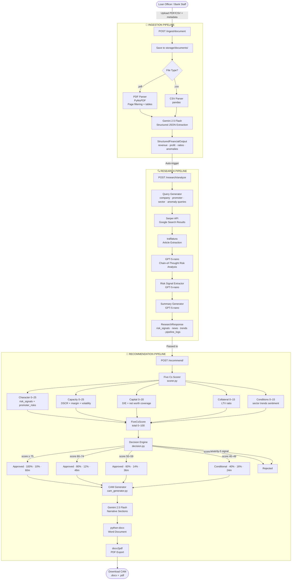
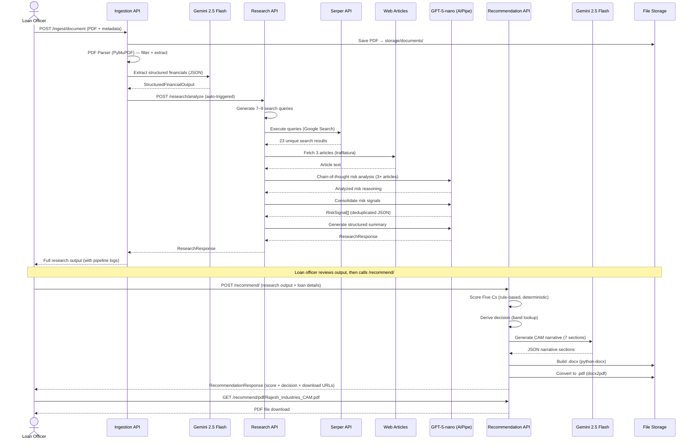

# Intelli-Credit AI — Wireframes & Flow Diagrams

> All wireframes are ASCII-art and Mermaid diagrams for inclusion in presentations, docs, and design reviews.

---

## WIREFRAME 1: Full System Architecture Flow



---

## WIREFRAME 2: Data Transformation — Rajesh Industries Example

```
┌─────────────────────────────────────────────────────────────────────────────┐
│  INPUT: rajesh_ar_2025.pdf  (Annual Report, 120 pages)                      │
│  + metadata: { company: "Rajesh Industries Pvt Ltd", sector: "manufacturing"│
│               promoters: ["Rajesh Kumar"], location: "India" }              │
└──────────────────────────────┬──────────────────────────────────────────────┘
                               │
                               ▼
┌─────────────────────────────────────────────────────────────────────────────┐
│  STAGE 1a: PDF PARSER                                                       │
│  ▸ Total pages: 120                                                        │
│  ▸ Noise pages filtered out: 48  (Chairman's letter, CSR, Awards)          │
│  ▸ Financial pages retained: 72  (P&L, Balance Sheet, Cashflows, Notes)    │
│  ▸ Tables extracted: 10                                                    │
│  ▸ Raw text extracted: ~55,000 chars                                       │
└──────────────────────────────┬──────────────────────────────────────────────┘
                               │
                               ▼
┌─────────────────────────────────────────────────────────────────────────────┐
│  STAGE 1b: GEMINI 2.5 FLASH EXTRACTION                                      │
│                                                                             │
│  StructuredFinancialOutput:                                                 │
│  ┌─────────────────────────────────────────────────────────────────────┐   │
│  │ financial_summary:                                                  │   │
│  │   revenue:            ₹ 45,00,00,000  (₹45 Cr)                    │   │
│  │   profit:             ₹  6,75,00,000  (₹6.75 Cr)                  │   │
│  │   total_assets:       ₹ 38,00,00,000  (₹38 Cr)                    │   │
│  │   total_liabilities:  ₹ 16,00,00,000  (₹16 Cr)                    │   │
│  │   net_worth:          ₹ 22,00,00,000  (₹22 Cr)                    │   │
│  │                                                                     │   │
│  │ financial_ratios:                                                   │   │
│  │   debt_to_equity:     0.73                                         │   │
│  │   current_ratio:      1.85                                         │   │
│  │   profit_margin:      0.15  (15%)                                  │   │
│  │   dscr:               1.62                                         │   │
│  │                                                                     │   │
│  │ cashflow_analysis:                                                  │   │
│  │   monthly_avg_inflow:  ₹ 4,20,00,000                               │   │
│  │   monthly_avg_outflow: ₹ 3,60,00,000                               │   │
│  │   cashflow_volatility: "low"                                       │   │
│  │                                                                     │   │
│  │ anomalies_detected:  []   (none found)                             │   │
│  └─────────────────────────────────────────────────────────────────────┘   │
└──────────────────────────────┬──────────────────────────────────────────────┘
                               │ Auto-POST to /research/analyze
                               ▼
┌─────────────────────────────────────────────────────────────────────────────┐
│  STAGE 2: RESEARCH PIPELINE                                                 │
│                                                                             │
│  Queries generated (9 total):                                               │
│  ▸ "Rajesh Industries Pvt Ltd fraud news"                                  │
│  ▸ "Rajesh Industries Pvt Ltd litigation court case"                       │
│  ▸ "Rajesh Industries Pvt Ltd RBI SEBI action"                             │
│  ▸ "Rajesh Industries Pvt Ltd latest news 2025 2026"                       │
│  ▸ "Rajesh Kumar promoter background check"                                │
│  ▸ "manufacturing sector India outlook 2026"                               │
│  ▸ "manufacturing India credit risk 2026"                                  │
│                                                                             │
│  Search Results: 23 unique URLs from Serper API                             │
│  Articles Extracted: 3 successful (3 failures: anti-bot, 404)              │
│                                                                             │
│  LLM Analysis Output (per article):                                        │
│  ▸ Article 1: "Rajesh Industries in minor tax dispute with ITAT"           │
│    → Entity: Rajesh Industries | Event: Tax dispute | Severity: 2          │
│    → Risk Type: litigation | Evidence: "ITAT order dated Nov 2024..."      │
│                                                                             │
│  Risk Signals (consolidated):  1 signal found                              │
│  ┌──────────────────────────────────────────────────────────────────────┐  │
│  │ { risk_type: "litigation",                                          │  │
│  │   entity: "Rajesh Industries Pvt Ltd",                              │  │
│  │   severity: "2",                                                    │  │
│  │   source: "https://economictimes.indiatimes.com/...",               │  │
│  │   evidence: "ITAT order dated Nov 2024 — minor tax assessment",     │  │
│  │   confidence: "medium" }                                            │  │
│  └──────────────────────────────────────────────────────────────────────┘  │
│                                                                             │
│  Summary:                                                                   │
│  ▸ research_summary: "Rajesh Industries is a stable mid-sized mfg..."      │
│  ▸ company_news: ["Wins ₹12Cr export order from Germany..."]               │
│  ▸ promoter_risks: []                                                      │
│  ▸ sector_trends: ["Manufacturing PMI at 56.2, 14-month high..."]          │
└──────────────────────────────┬──────────────────────────────────────────────┘
                               │
                               ▼
┌─────────────────────────────────────────────────────────────────────────────┐
│  STAGE 3: FIVE Cs SCORING                                                   │
│                                                                             │
│  Input: Loan = ₹50L, Collateral = ₹80L (residential property)              │
│                                                                             │
│  CHARACTER  (max 25)                                                        │
│  ┌──────────────────────────────────────────────────────────────────────┐  │
│  │ Start: 25 pts                                                        │  │
│  │ − Litigation severity 2: base=3, type_extra=1 → −4 pts              │  │
│  │ Promoter risks: 0 → no deduction                                    │  │
│  │ CHARACTER SCORE: 21 / 25                                            │  │
│  └──────────────────────────────────────────────────────────────────────┘  │
│                                                                             │
│  CAPACITY   (max 25)                                                        │
│  ┌──────────────────────────────────────────────────────────────────────┐  │
│  │ DSCR = 1.62 (≥1.5)  → 10/10 pts                                    │  │
│  │ Profit Margin = 15% (≥15%)  → 8/8 pts                              │  │
│  │ Cashflow Volatility = "low"  → 7/7 pts                             │  │
│  │ CAPACITY SCORE: 25 / 25                                             │  │
│  └──────────────────────────────────────────────────────────────────────┘  │
│                                                                             │
│  CAPITAL    (max 20)                                                        │
│  ┌──────────────────────────────────────────────────────────────────────┐  │
│  │ D/E = 0.73 (<1.0)  → 10/10 pts                                      │  │
│  │ Net Worth = ₹22Cr, Loan = ₹5Cr → coverage 4.4×  → 10/10 pts        │  │
│  │ CAPITAL SCORE: 20 / 20                                              │  │
│  └──────────────────────────────────────────────────────────────────────┘  │
│                                                                             │
│  COLLATERAL (max 15)                                                        │
│  ┌──────────────────────────────────────────────────────────────────────┐  │
│  │ LTV = ₹5Cr / ₹8Cr = 62.5%  → LTV ≤70% → 11/15 pts                 │  │
│  │ COLLATERAL SCORE: 11 / 15                                           │  │
│  └──────────────────────────────────────────────────────────────────────┘  │
│                                                                             │
│  CONDITIONS (max 15)                                                        │
│  ┌──────────────────────────────────────────────────────────────────────┐  │
│  │ Baseline: 10 pts                                                     │  │
│  │ Sector trends: "PMI 56.2, growth", "exports rising" → +3 pts        │  │
│  │ No industry risk signals → no deduction                             │  │
│  │ CONDITIONS SCORE: 13 / 15                                           │  │
│  └──────────────────────────────────────────────────────────────────────┘  │
│                                                                             │
│  ┌──────────────────────────────────────────────────────────────────────┐  │
│  │  TOTAL SCORE: 21 + 25 + 20 + 11 + 13  =  90 / 100                 │  │
│  └──────────────────────────────────────────────────────────────────────┘  │
└──────────────────────────────┬──────────────────────────────────────────────┘
                               │
                               ▼
┌─────────────────────────────────────────────────────────────────────────────┐
│  STAGE 4: CREDIT DECISION                                                   │
│                                                                             │
│  Severity-5 signals: 0  → No hard rejection                                │
│  Score = 90  ≥ 75  → Band 1: APPROVED                                      │
│                                                                             │
│  ┌──────────────────────────────────────────────────────────────────────┐  │
│  │  STATUS:   APPROVED ✓                                               │  │
│  │  AMOUNT:   ₹ 50,00,000  (100% of requested)                        │  │
│  │  RATE:     10.0% per annum                                          │  │
│  │  TENOR:    60 months (5 years)                                      │  │
│  │  REASON:   "Approved with credit score 90/100. Strongest factor:   │  │
│  │             Capacity (25 pts). Key constraint: Collateral (11 pts)"│  │
│  └──────────────────────────────────────────────────────────────────────┘  │
└──────────────────────────────┬──────────────────────────────────────────────┘
                               │
                               ▼
┌─────────────────────────────────────────────────────────────────────────────┐
│  STAGE 5: CAM GENERATION                                                    │
│                                                                             │
│  Gemini 2.5 Flash → Narrative JSON (7 sections)                             │
│  python-docx → Rajesh_Industries_a1b2c3_CAM.docx                           │
│  docx2pdf    → Rajesh_Industries_a1b2c3_CAM.pdf                            │
│                                                                             │
│  Download URLs:                                                             │
│  ▸ GET /recommend/cam/Rajesh_Industries_a1b2c3_CAM.docx                    │
│  ▸ GET /recommend/pdf/Rajesh_Industries_a1b2c3_CAM.pdf                     │
└─────────────────────────────────────────────────────────────────────────────┘
```

---

## WIREFRAME 3: API Endpoint Map

```
http://localhost:8000
│
├── GET  /                          → Health check
│                                     Returns: {"message": "Welcome..."}
│
├── GET  /docs                      → Swagger UI (interactive API browser)
│
├── POST /ingest/document           ← multipart/form-data
│         files[]:    [.pdf, .csv]
│         metadata:   JSON string
│         ─────────────────────────────────────────────────
│         Returns: ResearchResponse (full 6-stage output)
│
├── POST /research/analyze          ← JSON body: ResearchRequest
│         company_name, sector,
│         promoters[], financial_data?
│         ─────────────────────────────────────────────────
│         Returns: ResearchResponse
│           research_summary, company_news[], promoter_risks[],
│           sector_trends[], risk_signals[], pipeline_logs[]
│
├── POST /recommend/                ← JSON body: RecommendationRequest
│         company_name, sector,
│         loan_requested, collateral_value,
│         collateral_description,
│         promoters[], research_summary,
│         company_news[], promoter_risks[],
│         sector_trends[], risk_signals[],
│         financial_data?
│         ─────────────────────────────────────────────────
│         Returns: RecommendationResponse
│           score_breakdown, score_explanation,
│           decision, cam_report_url, cam_pdf_url
│
├── GET  /recommend/cam/{filename}  → Download .docx CAM file
│
└── GET  /recommend/pdf/{filename}  → Download .pdf CAM file
```

---

## WIREFRAME 4: Component Dependency Map

```
main.py
  ├── ingestion/router.py
  │     └── ingestion/service.py
  │           ├── ingestion/parser/dispatcher.py
  │           │     ├── ingestion/parser/pdf_parser.py   → fitz (PyMuPDF)
  │           │     │     └── ingestion/parser/constants.py
  │           │     └── ingestion/parser/csv_parser.py   → pandas
  │           └── ingestion/summarizer.py               → common/gemini_client.py
  │                 └── ingestion/prompts.py
  │
  ├── research/router.py
  │     └── research/service.py
  │           ├── research/search_service.py             → Serper API (httpx)
  │           ├── research/scraper.py                    → trafilatura
  │           ├── research/analyzer.py                   → common/aipipe_client.py
  │           │     └── research/prompts.py
  │           └── research/pipeline_logger.py
  │
  └── recommendation/router.py
        └── recommendation/service.py
              ├── recommendation/scorer.py
              ├── recommendation/decision.py
              └── recommendation/cam_generator.py        → common/gemini_client.py
                    └── recommendation/prompts.py
                          ├── python-docx
                          └── docx2pdf

  common/
    ├── config.py          → python-dotenv (.env)
    ├── gemini_client.py   → google-generativeai SDK
    ├── aipipe_client.py   → openai SDK (AIPipe base URL)
    └── utils.py
```

---

## WIREFRAME 5: Decision Engine State Machine

```
                      ┌──────────────────┐
                      │  RecommendRequest │
                      └────────┬─────────┘
                               │
                               ▼
                  ┌────────────────────────┐
                  │ Any severity-5 signal? │
                  └────────┬───────────────┘
                    YES ───┤                 NO
                           ▼                 │
                  ┌──────────────┐           ▼
                  │  HARD REJECT │  ┌──────────────────┐
                  │  (critical   │  │  Total score < 40?│
                  │   risk cited)│  └──────────┬────────┘
                  └──────────────┘     YES ────┤    NO
                                              ▼     │
                                    ┌──────────┐    ▼
                                    │  REJECT  │  ┌──────────────────┐
                                    │  (<40)   │  │  Score 40–49?    │
                                    └──────────┘  └──────┬───────────┘
                                                   YES───┤     NO
                                                         ▼      │
                                               ┌────────────┐   ▼
                                               │CONDITIONAL │ ┌──────────────────┐
                                               │  40% loan  │ │  Score 50–59?    │
                                               │  16% rate  │ └──────┬───────────┘
                                               │  24 months │  YES───┤     NO
                                               └────────────┘        ▼      │
                                                             ┌──────────┐   ▼
                                                             │APPROVED  │ ┌────────────────┐
                                                             │ 60% loan │ │  Score 60–74?  │
                                                             │ 14% rate │ └──────┬─────────┘
                                                             │ 36 months│  YES───┤     NO
                                                             └──────────┘        ▼      │
                                                                        ┌──────────┐   ▼
                                                                        │APPROVED  │ ┌──────────┐
                                                                        │ 80% loan │ │APPROVED  │
                                                                        │ 12% rate │ │100% loan │
                                                                        │ 48 months│ │ 10% rate │
                                                                        └──────────┘ │ 60 months│
                                                                                     └──────────┘
                                                                                   (score 75–100)
```

---

## WIREFRAME 6: Research Pipeline — 6 Stages Detail

```
ResearchRequest
{"company_name": "Rajesh Industries",
 "sector": "manufacturing",
 "promoters": ["Rajesh Kumar"],
 "financial_data": {...}}
       │
       │
  ╔════╧══════════════════════════════════════════════════════════════╗
  ║  STAGE 1 — QUERY GENERATION                                      ║
  ║  ──────────────────────────────────────────────────────────────  ║
  ║  Output queries:                                                 ║
  ║  1. "Rajesh Industries Pvt Ltd fraud news"                       ║
  ║  2. "Rajesh Industries Pvt Ltd litigation court case"            ║
  ║  3. "Rajesh Industries Pvt Ltd RBI SEBI penalty"                 ║
  ║  4. "Rajesh Industries Pvt Ltd 2025 2026 news"                   ║
  ║  5. "Rajesh Kumar promoter fraud criminal record"                ║
  ║  6. "manufacturing sector India outlook 2026"                    ║
  ║  7. "manufacturing PMI India latest"                             ║
  ╚════╤══════════════════════════════════════════════════════════════╝
       │
  ╔════╧══════════════════════════════════════════════════════════════╗
  ║  STAGE 2 — SERPER API (Google Search)                            ║
  ║  ──────────────────────────────────────────────────────────────  ║
  ║  → 7 queries × ~4 results = ~28 raw results                      ║
  ║  → Deduplicated by URL: 23 unique results                        ║
  ║  Each result: { title, link, snippet, source }                   ║
  ╚════╤══════════════════════════════════════════════════════════════╝
       │
  ╔════╧══════════════════════════════════════════════════════════════╗
  ║  STAGE 3 — ARTICLE EXTRACTION (trafilatura)                      ║
  ║  ──────────────────────────────────────────────────────────────  ║
  ║  Iterate URLs, stop after 3 successful extractions:              ║
  ║  URL 1: ✓ Extracted 2,400 chars (tax dispute article)            ║
  ║  URL 2: ✗ Failed — anti-bot block (MoneyControl)                 ║
  ║  URL 3: ✓ Extracted 1,800 chars (sector PMI article)             ║
  ║  URL 4: ✗ Failed — 404                                           ║
  ║  URL 5: ✓ Extracted 3,100 chars (company expansion news)         ║
  ║  Target 3 reached — stop                                         ║
  ╚════╤══════════════════════════════════════════════════════════════╝
       │
  ╔════╧══════════════════════════════════════════════════════════════╗
  ║  STAGE 4 — LLM RISK ANALYSIS (GPT-5-nano via AIPipe)            ║
  ║  ──────────────────────────────────────────────────────────────  ║
  ║  Per article, chain-of-thought:                                  ║
  ║  Article 1 analysis:                                             ║
  ║    Entities: Rajesh Industries, ITAT Mumbai                      ║
  ║    Event: Tax assessment dispute, ₹45L demand                    ║
  ║    Risk Type: litigation | Severity: 2 (minor)                   ║
  ║    Evidence: "ITAT order Nov 2024 — routine reassessment"        ║
  ║                                                                  ║
  ║  Article 3 analysis:                                             ║
  ║    Entities: Indian manufacturing sector                         ║
  ║    Event: PMI at 56.2, strong export growth                      ║
  ║    Risk Type: industry | Severity: 1 (positive signal)          ║
  ╚════╤══════════════════════════════════════════════════════════════╝
       │
  ╔════╧══════════════════════════════════════════════════════════════╗
  ║  STAGE 5 — RISK SIGNAL EXTRACTION (GPT-5-nano)                  ║
  ║  ──────────────────────────────────────────────────────────────  ║
  ║  Consolidated, deduplicated JSON:                                ║
  ║  [{ risk_type: "litigation",                                     ║
  ║     entity: "Rajesh Industries Pvt Ltd",                         ║
  ║     severity: "2",                                               ║
  ║     source: "https://economictimes.indiatimes.com/...",          ║
  ║     evidence: "ITAT order Nov 2024 — minor reassessment",        ║
  ║     confidence: "medium" }]                                      ║
  ╚════╤══════════════════════════════════════════════════════════════╝
       │
  ╔════╧══════════════════════════════════════════════════════════════╗
  ║  STAGE 6 — STRUCTURED SUMMARY (GPT-5-nano)                      ║
  ║  ──────────────────────────────────────────────────────────────  ║
  ║  research_summary: "Rajesh Industries Pvt Ltd is a stable        ║
  ║    mid-sized manufacturing firm. One minor tax dispute noted..."  ║
  ║  company_news: ["Rajesh Industries wins ₹12Cr export order"]     ║
  ║  promoter_risks: []                                              ║
  ║  sector_trends: ["Manufacturing PMI at 56.2, 14-month high"]     ║
  ╚════╧══════════════════════════════════════════════════════════════╝
```

---

## WIREFRAME 7: CAM Document Layout (Visual)

```
╔══════════════════════════════════════════════════════════════════════════════╗
║                    CREDIT APPRAISAL MEMO (CAM)                             ║
║                  Rajesh Industries Pvt Ltd                                 ║
║                  Date: March 12, 2026  |  Ref: a1b2c3                     ║
╠══════════════════════════════════════════════════════════════════════════════╣
║                                                                            ║
║  1. EXECUTIVE SUMMARY                                                      ║
║  ─────────────────────────────────────────────────────────────────         ║
║  [Gemini-generated paragraph summarizing the entire proposal,              ║
║   loan amount, company background, and recommendation status]              ║
║                                                                            ║
╠══════════════════════════════════════════════════════════════════════════════╣
║                                                                            ║
║  2. APPLICANT PROFILE                                                      ║
║  ─────────────────────────────────────────────────────────────────         ║
║  Company Name:     Rajesh Industries Pvt Ltd                               ║
║  Sector:          Manufacturing                                            ║
║  Promoters:       Rajesh Kumar                                             ║
║  Loan Requested:  ₹ 50,00,000                                              ║
║  Collateral:      Residential property, registered mortgage                ║
║  Collateral Value: ₹ 80,00,000                                            ║
║                                                                            ║
╠══════════════════════════════════════════════════════════════════════════════╣
║                                                                            ║
║  3. FIVE Cs ANALYSIS                                                       ║
║  ─────────────────────────────────────────────────────────────────         ║
║  CHARACTER  (21/25)                                                        ║
║  [Narrative paragraph] + Score breakdown table                             ║
║                                                                            ║
║  CAPACITY   (25/25)                                                        ║
║  [Narrative paragraph] + DSCR/margin/volatility table                     ║
║                                                                            ║
║  CAPITAL    (20/20)                                                        ║
║  [Narrative paragraph] + D/E and net worth table                          ║
║                                                                            ║
║  COLLATERAL (11/15)                                                        ║
║  [Narrative paragraph] + LTV calculation                                  ║
║                                                                            ║
║  CONDITIONS (13/15)                                                        ║
║  [Narrative paragraph] + sector trend summary                             ║
║                                                                            ║
╠══════════════════════════════════════════════════════════════════════════════╣
║                                                                            ║
║  4. FINANCIAL ANALYSIS                                                     ║
║  ─────────────────────────────────────────────────────────────────         ║
║  ┌──────────────────────────┬───────────────────────────────────────┐     ║
║  │ Metric                   │ Value                                 │     ║
║  ├──────────────────────────┼───────────────────────────────────────┤     ║
║  │ Revenue                  │ ₹ 45,00,00,000                        │     ║
║  │ Net Profit               │ ₹  6,75,00,000                        │     ║
║  │ Total Assets             │ ₹ 38,00,00,000                        │     ║
║  │ Net Worth                │ ₹ 22,00,00,000                        │     ║
║  │ Debt-to-Equity           │ 0.73                                  │     ║
║  │ DSCR                     │ 1.62                                  │     ║
║  │ Profit Margin            │ 15.0%                                 │     ║
║  │ Cashflow Volatility      │ Low                                   │     ║
║  └──────────────────────────┴───────────────────────────────────────┘     ║
║                                                                            ║
╠══════════════════════════════════════════════════════════════════════════════╣
║                                                                            ║
║  5. RISK MATRIX                                                            ║
║  ─────────────────────────────────────────────────────────────────         ║
║  ┌──────────────┬─────────────────────────┬──────────┬───────────────┐    ║
║  │ Risk Type    │ Entity                  │ Severity │ Evidence      │    ║
║  ├──────────────┼─────────────────────────┼──────────┼───────────────┤    ║
║  │ litigation   │ Rajesh Industries       │    2     │ ITAT order... │    ║
║  └──────────────┴─────────────────────────┴──────────┴───────────────┘    ║
║                                                                            ║
╠══════════════════════════════════════════════════════════════════════════════╣
║                                                                            ║
║  6. CREDIT SCORE SUMMARY                                                   ║
║  ─────────────────────────────────────────────────────────────────         ║
║  ┌──────────────┬───────────┬───────────────────────────────────────┐     ║
║  │ Parameter    │ Score     │ Max                                   │     ║
║  ├──────────────┼───────────┼───────────────────────────────────────┤     ║
║  │ Character    │    21     │  25                                   │     ║
║  │ Capacity     │    25     │  25                                   │     ║
║  │ Capital      │    20     │  20                                   │     ║
║  │ Collateral   │    11     │  15                                   │     ║
║  │ Conditions   │    13     │  15                                   │     ║
║  ├──────────────┼───────────┼───────────────────────────────────────┤     ║
║  │ TOTAL        │    90     │ 100                                   │     ║
║  └──────────────┴───────────┴───────────────────────────────────────┘     ║
║                                                                            ║
╠══════════════════════════════════════════════════════════════════════════════╣
║                                                                            ║
║  7. RECOMMENDATION & DECISION                                              ║
║  ─────────────────────────────────────────────────────────────────         ║
║                                                                            ║
║  ✅  STATUS:  APPROVED                                                     ║
║                                                                            ║
║  Recommended Loan Amount:  ₹ 50,00,000                                    ║
║  Interest Rate:             10.0% per annum                               ║
║  Tenor:                     60 months                                     ║
║                                                                            ║
║  [Gemini-generated full reasoning paragraph]                               ║
║                                                                            ║
╚══════════════════════════════════════════════════════════════════════════════╝
```

---

## WIREFRAME 8: Scoring Radar Chart Data (For PPT Chart)

```
Five Cs Radar Chart — Rajesh Industries Example
(Normalize each to 100%)

Character:   21/25  = 84%   ████████████████████░░░░
Capacity:    25/25  = 100%  ████████████████████████
Capital:     20/20  = 100%  ████████████████████████
Collateral:  11/15  = 73%   █████████████████░░░░░░░
Conditions:  13/15  = 87%   ████████████████████░░░░

Overall:     90/100 = 90%
```

---

## WIREFRAME 9: Mermaid Sequence Diagram — Full Request Lifecycle


